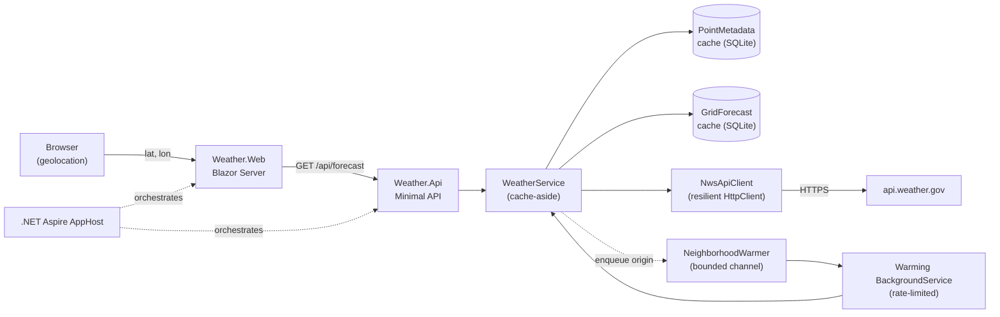

# Architecture

This document explains how the weather dashboard is put together and, in
particular, the three design decisions that shape it: how forecasts are cached,
how a neighbourhood of grid cells is warmed without slowing the user down, and
how the whole thing is made observable.

## The shape of the system

The projects map onto clean layers:

- **Weather.Core** — domain models and abstractions only. No I/O, no framework
  dependencies. It defines `GeoCoordinate`, `GridPoint`, `Forecast`, the cache
  and client interfaces, and the telemetry primitives.
- **Weather.Infrastructure** — the implementations: the NWS HTTP client, the
  SQLite/Dapper caches, the orchestrating `WeatherService`, and the background
  warmer. Most types are `internal`; the composition root (`AddWeatherInfrastructure`)
  is the public surface.
- **Weather.Api** — a thin Minimal-API edge. It validates coordinates and
  delegates to `IWeatherService`; caching and resilience are invisible to it.
- **Weather.Web** — the Blazor Server dashboard. It owns the browser-geolocation
  flow and the graceful fallbacks.
- **Weather.ServiceDefaults** — the shared Aspire wiring (OpenTelemetry, health
  checks, service discovery, resilient `HttpClient` defaults).
- **Weather.AppHost** — the Aspire orchestrator that runs API + Web together.

## The request flow

1. The browser resolves the user's location and the dashboard calls
   `GET /api/forecast?latitude={lat}&longitude={lon}`.
2. The endpoint validates the coordinate and calls `IWeatherService.GetForecastAsync`.
3. The service rounds the coordinate to four decimals and resolves it to an NWS
   **grid cell** — first from the point-metadata cache, then (on a miss) from the
   NWS `/points` endpoint.
4. With the grid cell known, it reads the **forecast cache**. If the entry is
   fresh, it's returned immediately. If it's stale or missing, it calls NWS
   `/gridpoints/.../forecast` — using a conditional request when an ETag is
   known — and updates the cache.
5. Whenever a forecast is produced, the service drops the origin cell onto the
   warming queue so the surrounding cells can be fetched in the background.

## Decision 1 — Caching the NWS data

**Goal:** be fast and never hammer `api.weather.gov`, while keeping the cache
invisible to users (they always see current data, just faster on repeat views).

The NWS API is two calls: a coordinate resolves to a grid cell via `/points`,
and the forecast for that cell comes from `/gridpoints`. These have very
different change rates, so they get **two cache tiers**, both in SQLite:

| Tier | Source | Key | TTL |
| --- | --- | --- | --- |
| Point metadata | `/points/{lat},{lon}` | coordinate rounded to 4 dp | 30 days |
| Grid forecast | `/gridpoints/{id}/{x},{y}/forecast` | `(GridId, GridX, GridY)` | NWS `max-age`, fallback 30 min, clamped to 6 h |

Key choices:

- **Coordinate→grid mappings effectively never change**, so they're cached for
  a long time. Rounding the coordinate to four decimals (~11 m) means physically
  close users collapse onto a single row and a single upstream `/points` call.
- **Forecasts are short-lived**, so the cache honours the HTTP `Cache-Control:
  max-age` NWS sends, falling back to 30 minutes and clamping to a 6-hour
  ceiling so an odd upstream value can't pin stale data.
- **Conditional GETs** keep refreshes cheap: the stored ETag is sent as
  `If-None-Match`; a `304 Not Modified` extends the TTL without transferring or
  re-parsing the payload.
- **Stale-on-error**: if NWS is unreachable, the last good forecast (and the
  long-lived metadata) is served rather than failing — the user sees data, not
  an error.
- **Storage details**: SQLite runs in WAL mode for read/write concurrency; the
  forecast payload is stored as JSON in one column with ETag and timestamps
  alongside for cheap inspection; timestamps are ISO-8601 round-trip ("O")
  strings parsed with the invariant culture so they never drift.

Freshness is decided in one place — `WeatherService` — because only that layer
knows the *semantic* outcome (hit, conditional renew, stale-served, miss).

## Decision 2 — Warming the neighbourhood without slowing the user

**Goal:** make panning to an adjacent area feel instant, without ever putting
that extra work on the user's request path.

The user's **own** cell is always on the hot path: a synchronous cache-aside
lookup. The 3×3 ring of **surrounding** cells is warmed **asynchronously**:

- When a forecast is served, the origin grid cell is dropped onto a **bounded
  `Channel<GridPoint>`** (capacity 256, drop-oldest). Enqueuing is non-blocking,
  so a traffic spike can never grow memory without bound or stall a request.
- A `BackgroundService` consumes the channel and fans out to the surrounding
  cells (`GridNeighborhood.Surrounding`), guarded three ways:
  - a **global token-bucket rate limiter** paces all outbound warming,
  - an **in-flight set** deduplicates concurrent work for the same cell,
  - cells that are **already fresh** are skipped before any network call.
- Each cell is fetched in **its own DI scope**, so the scoped `IWeatherService`
  never becomes a captive dependency of the singleton background service. The
  background path calls `GetForecastByGridAsync`, which deliberately does **not**
  enqueue more warming — otherwise warming would recurse forever.
- The neighbourhood endpoint returns the primary cell plus only the neighbours
  that are *already* warm; it never blocks to fetch them.

The result: the user pays for exactly one cell; their neighbours are prepared
opportunistically and politely.

## Decision 3 — Observability

**Goal:** make cache behaviour and upstream health measurable rather than a
mystery, and have it light up automatically when run under Aspire.

Two layers cooperate:

- **`Weather.ServiceDefaults`** (the Aspire pattern) configures OpenTelemetry
  metrics and tracing with OTLP export, plus ASP.NET Core / HttpClient / runtime
  instrumentation, health checks, and service discovery. Both the API and the
  web app call `AddServiceDefaults()`.
- **`WeatherTelemetry`** (in Core) defines the app-specific instruments via a
  `Meter` ("Weather.Cache") and an `ActivitySource` ("Weather.Nws"). These names
  are registered with OpenTelemetry in the API host so they flow to the same
  exporter as everything else.

Instruments:

| Instrument | Type | Tags | Meaning |
| --- | --- | --- | --- |
| `weather.cache.requests` | counter | `cache` (forecast/metadata), `result` (hit/miss) | cache hit-rate |
| `weather.nws.request.duration` | histogram (ms) | `endpoint`, `status_code`, `conditional` | upstream latency |
| `weather.nws.throttled` | counter | `endpoint` | NWS 429s |
| `weather.nws.errors` | counter | `endpoint`, `status_code` | upstream failures |
| `weather.neighborhood.warmed` | counter | `grid_id` | background warming activity |

Tracing spans from `Weather.Nws` wrap the outbound NWS calls, so a slow forecast
shows up as a span with its status and timing rather than an unexplained pause.

Run the system through the [AppHost](../src/Weather.AppHost/README.md) and these
signals appear in the Aspire dashboard with no extra configuration.

## Cross-cutting choices

- **Time** is taken from the BCL `TimeProvider` everywhere, so freshness logic is
  deterministic under test (a controllable provider replaces the system clock).
- **JSON** uses a single shared `System.Text.Json` options instance for both the
  NWS wire format and the cache round-trip (camelCase, case-insensitive).
- **Resilience** is `Microsoft.Extensions.Http.Resilience` (the supported wrapper
  over Polly v8): retry with jitter, a circuit breaker, and timeouts on the NWS
  client, configured in the infrastructure composition root.
- **Geolocation failure is a normal path, not an exception**: the browser bridge
  always resolves a result object, and the UI branches to a manual-entry fallback
  for every failure mode. See [Weather.Web](../src/Weather.Web/README.md).
